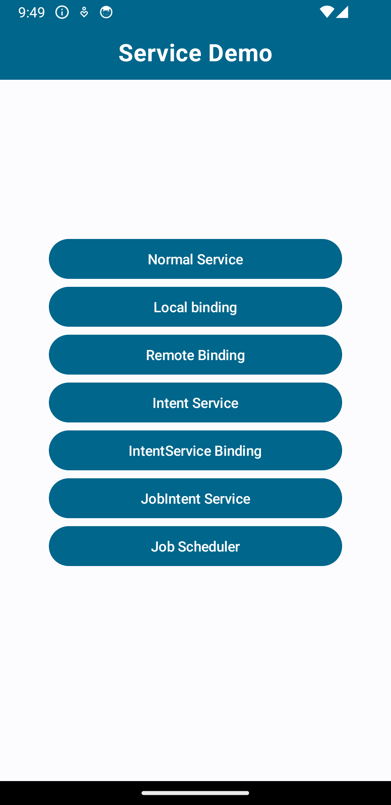
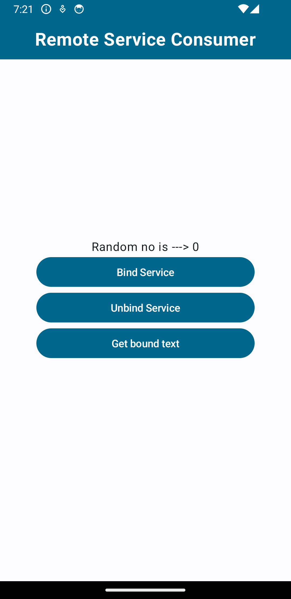

# Android-Services-2024

## Description

Android-Services-2024 is a comprehensive repository dedicated to showcasing the implementation of various types of Android services. Designed primarily for developers seeking practical examples and insights into background processing in Android applications, this repository covers a wide range of topics related to Android services.

The repository includes implementations of the following key topics:

- **Services:** Learn how to create and manage Android services, which are components that run in the background to perform long-running operations.
- **Local Bound Services:** Explore the concept of bound services, which allow components (such as activities) to bind to a service, send requests, and receive responses.
- **Remote Bound Services:** Understand how to create bound services that allow inter-process communication (IPC) between the service and client components in different processes.
- **Intent Services:** Discover how to use intent services to handle asynchronous requests on a background thread. Intent services are particularly useful for offloading tasks from the main thread.
- **Intent Services Bind:** Learn how to bind to an intent service to communicate with it and receive responses back from the service.
- **JobIntent Services:** Dive into job intent services, which provide more control over background tasks and are optimized for use with Android's JobScheduler API.
- **Job Schedulers:** Explore the use of job schedulers for executing background tasks based on various conditions, such as network connectivity or device charging status.

The implementations in this repository are written in Kotlin and leverage Coroutines for efficient asynchronous programming. Each topic is accompanied by practical examples and best practices for effective utilization in real-world Android applications.

Whether you're a beginner looking to grasp the fundamentals of Android services or an experienced developer seeking advanced insights, Android-Services-2024 provides valuable resources and hands-on examples to enhance your skills and understanding of Android app development.

### Technologies Used:

- **Kotlin**
- **Coroutines**
- **Android Services**

## Screenshots

## Remote Binding Consumer

## Table of Contents

- [Installation](#installation)
- [Usage](#usage)
- [Contribute](#contribute)
- [License](#license)

## Installation

1. Clone the repository:
git clone https://github.com/rahulgothwal5/Android-Services-2024.git
2. Open the project in Android Studio.

## Usage

Explore the codebase to learn about Android Services and how they can be implemented using Kotlin and Coroutines for background processing in Android applications.

## Contribute

Contributions are welcome! Here's how you can contribute to this project:
- Fork the repository.
- Create a new branch (`git checkout -b feature/your-feature-name`).
- Make your changes.
- Commit your changes (`git commit -am 'Add new feature'`).
- Push to the branch (`git push origin feature/your-feature-name`).
- Create a new Pull Request.

## License

This project is licensed under the [MIT License](LICENSE).
